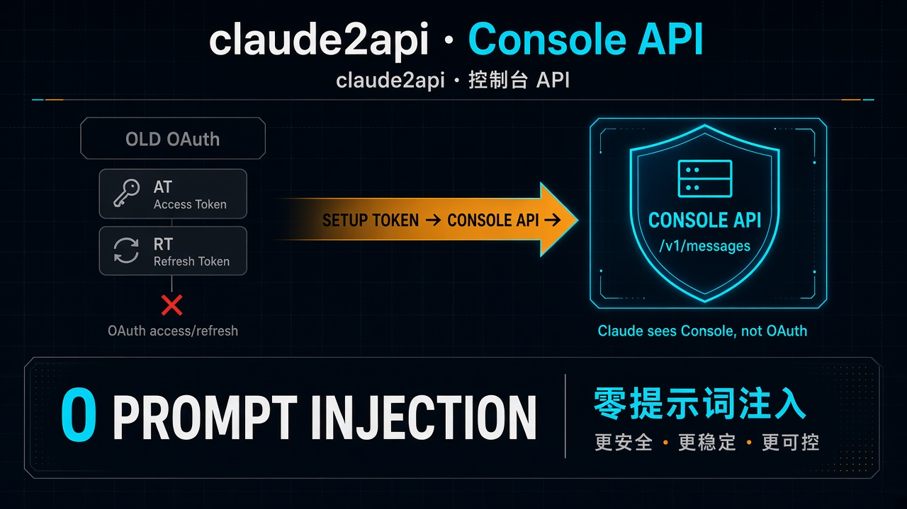
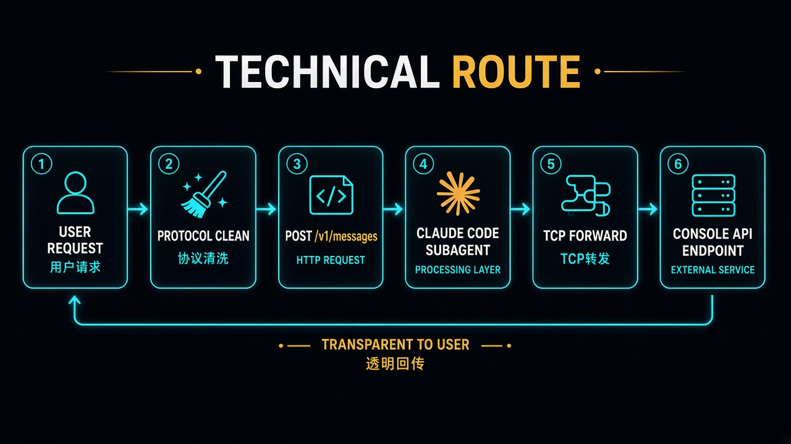
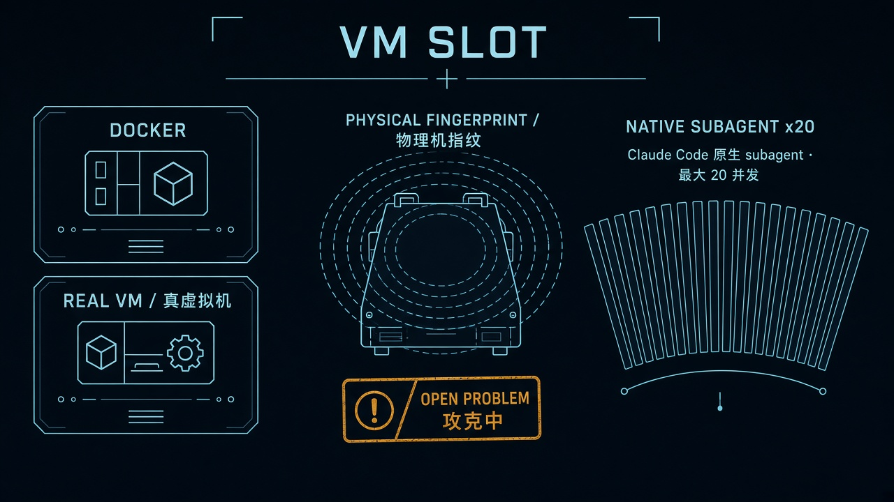
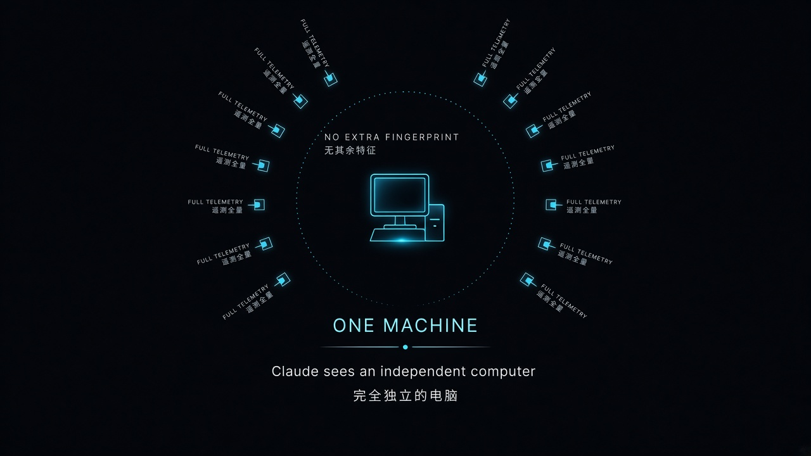
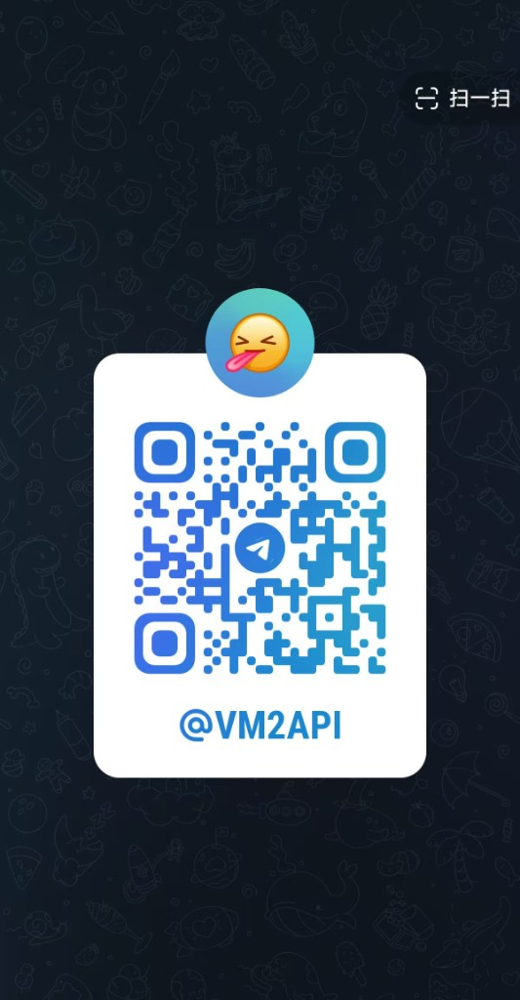
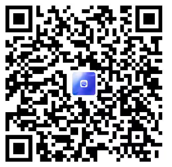

# vm2api

**claude2api。** 虚拟机拟真 + Claude Code 原生 subagent，把 Setup Token 做成 Console 可用 API。  
Claude 看到的是 **Console API**，不是 OAuth。因此 **0 提示词注入**。

主路线：[技术路线](docs/技术路线.md)

---

## 核心：Console API，不是 OAuth



独家 Console API。Setup Token 转成 Console 可用 API，**取代** OAuth 换来的 AT / RT。

| 旧路 | 本仓 |
|------|------|
| OAuth 拿到 AT / RT，上游按 OAuth 客户端看你 | Setup Token → Console API |
| 为了像官方，要注人设 / 提示词 | Claude 认为你是 Console API |
| 提示词注入有泄漏面 | **0 提示词注入** |

---

## 技术路线



```text
用户请求
  → 协议清洗
  → POST /v1/messages
  → 接入 Claude Code 原生 subagent
  → TCP 转发
  → Console API endpoint
  → 透明转发给用户
```

控制面只做清洗与调度。推理在虚拟机里走 Claude Code 原生 subagent，再 TCP 打到 Console API。回包原样给调用方。

---

## 虚拟机槽位



- 槽位可以是 **Docker**，也可以是 **真虚拟机**
- 槽内用 **Claude Code 原生 subagent** 转发，最大 **20 并发**
- **拟真物理机指纹** 仍在攻克。欢迎提供方案

---

## 遥测与身份



遥测全量发送。目标：Claude 认为你是一台 **完全独立的电脑**，并且 **无其余特征**。

---

## 仓库

```text
web/                  Vite 管理台
src/                  Node 控制面
crates/kin-kernel     Claude Code Rust 内核
worker/cmd/kin-egress SOCKS5 透明网关（本地出口不走它）
docs/                 路线图 + 契约
```

```bash
npm ci && npm test
npm run build:kernel && npm run build:web
export VM2API_API_KEY=... VM2API_ADMIN_PASSWORD=... VM2API_DB_SECRET=...
node src/server.mjs    # :8787   管理台 GET /console
```

二进制走 GitHub Release，不要把 ELF 提交进 git。不要提交凭证。

更多契约：[docs/](docs/README.md)

---

## 交流与支持

Telegram 群组：[t.me/VM2API](https://t.me/VM2API)（`@VM2API`）

开源维护需要时间。扫码进群或支持一下，谢谢。




感谢 liunx do 论坛支持。
